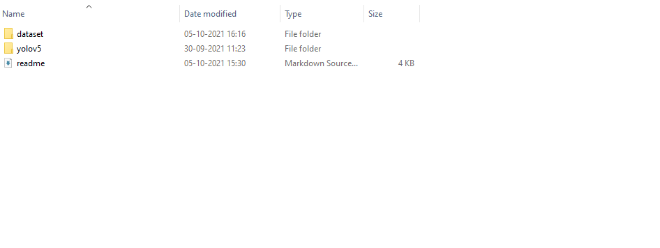
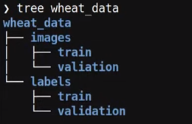
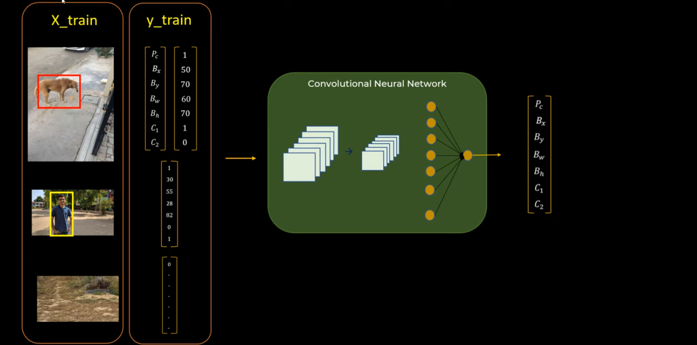
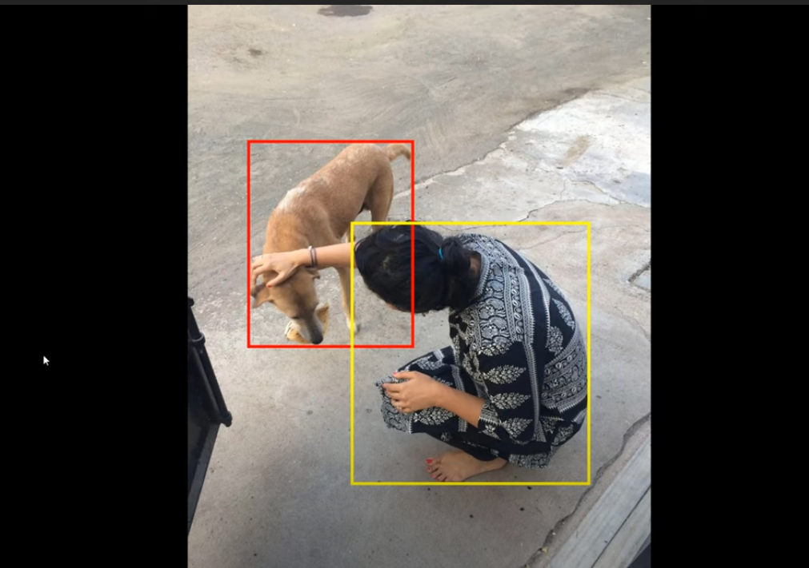
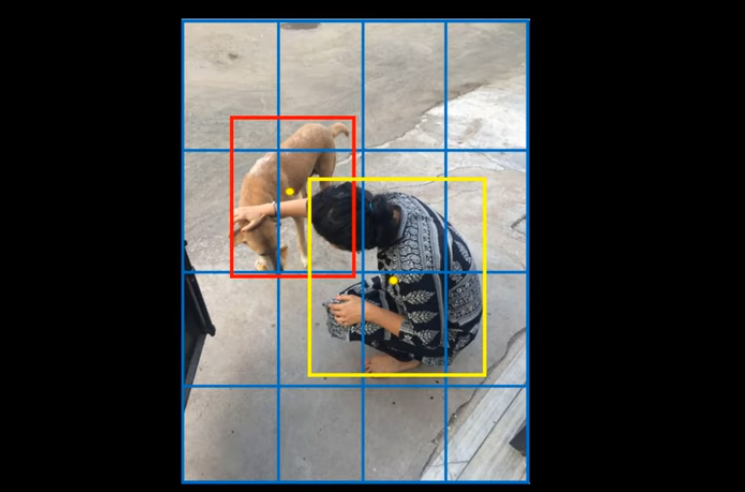
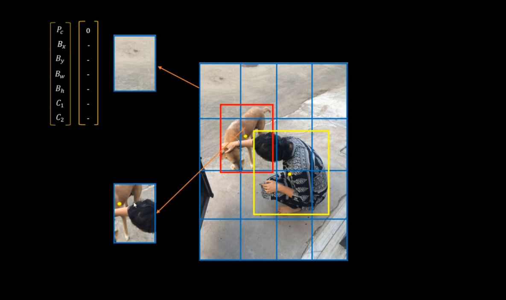
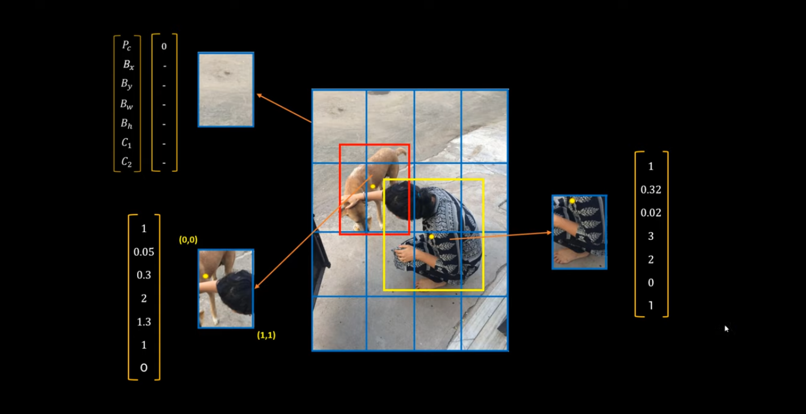
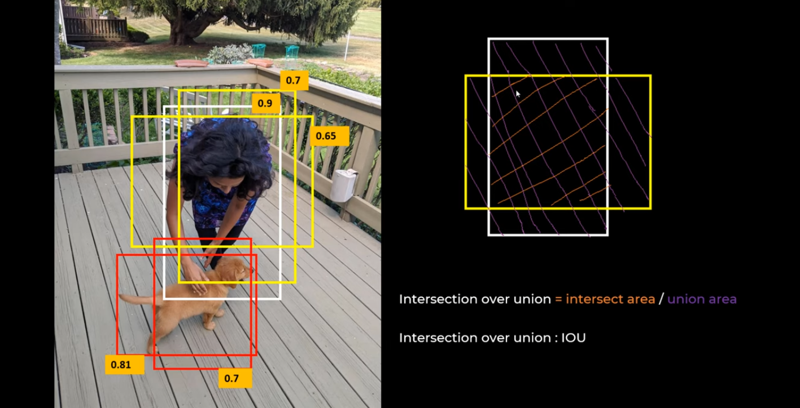
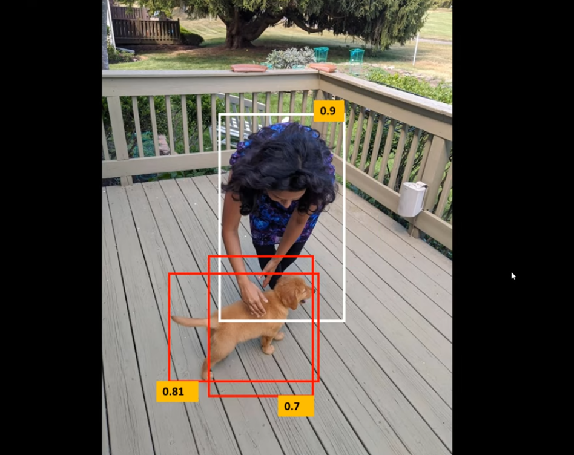
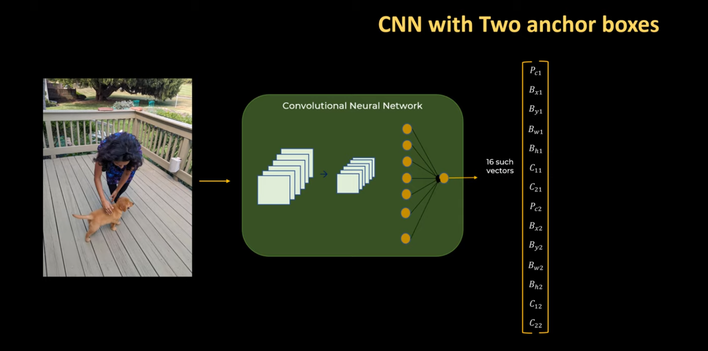

# yolov5_customdataset

How to train custom dataset on YOLO V5:

1.git clone YOLOv5 repo (https://github.com/ultralytics/yolov5).

2.download any dataset (I used wheat dataset from kaggle (https://www.kaggle.com/c/global-wheat-detection)).

3.place editing.py , wheat.yaml and wheat_data in git cloned yolov5 model.

4.if dataset is different than make changes in wheat_data accordingly.

5.Place folders according to directories.

6.run using : "pyton train.py --img 1024 --batch 8 --epochs 100 --data wheat.yaml --cfg models/yolov5s.yaml --name wm -- weights."

Note : in my repo, downloaded dataset and yolov5 repo is missing.

Reference Video : https://www.youtube.com/watch?v=NU9Xr_NYslo

YOLO : You Only Look Once

In 1 forward pass, do the prediction.

Sliding Window
RCNN
FAST RCNN
FASTER RCNN
YOLO : Real Time Object Detection

Image Classification and Image Localization(bounding box around object):

How to tell machine about the localization : there will be xtrain(image) and ytrain(vectors).

Have many thousands images in your dataset and train them.

This is for single objects. For multiple objects :

YOLO algo will divide the image into grid cells of 4*4 or 3*3 or anything.

For every grid, there will be a vector.
Centre point of object is considered in such cases as object will be present in multiple grids.

Vector size = 7 ==> 4*4*7.
Again we will be having thousands of such images.

Some Tweaks : Non Max Suppression
Intersection Over Union :
If completely overlapping, value = 1
Discard those rectangles which have higher IOU and kept the single rectangle which has max class probability.

What will happen if single grid cell has centre of 2 objects :
We will have 14 vectors or 2 anchor boxes(concatenate 2 anchor boxes). We might have more than 2 or 3 anchor boxes.

YOLOv4 :
The "Secret" to YOLOv4 isn't Architecture: It's in Data Preparation.
Different data Augmentations Technique  were used like :
    CutMix - Combine images by cutting parts from one image and pasting them onto the augmented image. Cutouts of the image force the model to learn to make predictions based on a robust amount of features.

    Mosaic data augmentation - Mosaic data augmentation combines 4 training images into one in certain ratios (instead of only two in CutMix). Mosaic [video] is the first new data augmentation technique introduced in YOLOv4. This allows for the model to learn how to identify objects at a smaller scale than normal.

YOLOv5 :
Glen Jocher : 

Glenn Jocher released YOLOv5 with a number of differences and improvements. (Notably, Glenn is the creator of mosaic augmentation, which is an included technique in what improved YOLOv4.)
V5 is small, fast and accurate.
 YOLOv5 is nearly 90 percent smaller than YOLOv4. This means YOLOv5 can be deployed to embedded devices much more easily.

In V3, training on custom datasets was a problem. Some objects has different aspect ratios than COCO dataset, Glenn used Kmeans method to resolve this, it helped upto a limit but in V5
when user upload custom dataset, code will look at anchors and compare them to data and if they didn't match well(below a certain threshold) than it will start training new anchors automatically using kmeans and genetic algorithm.
Custom datasets with long hz or vertical rectangles, than V5 is a lot better.

Mosaic data loader : Other augmentations after Mosaic data augmentation.

V3 Upscale the entire image which uses a lot of memory but in V5, size is decreased or increased but it is always cropped to the same size, due to which every image is scaled differently in a batch which increses variation. Also, we don't need extra memory. memory is exploited better in V5.

Screenshots Source and Tutorial Links :
YOLO V5 repo : (https://github.com/ultralytics/yolov5)
Thanks To Codebasics : https://www.youtube.com/watch?v=ag3DLKsl2vk
Thanks to Abhishek Thakur : https://www.youtube.com/watch?v=NU9Xr_NYslo